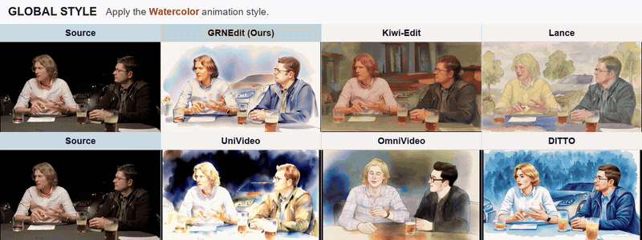
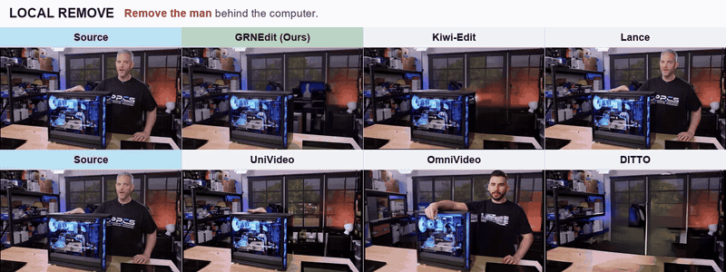
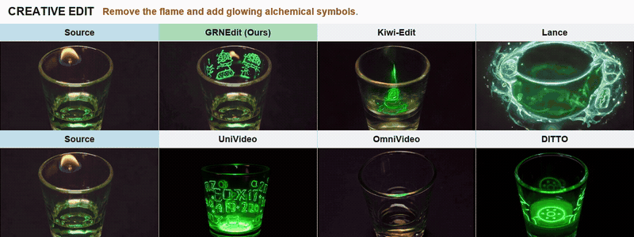
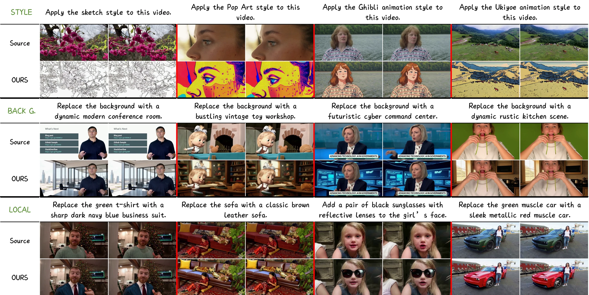
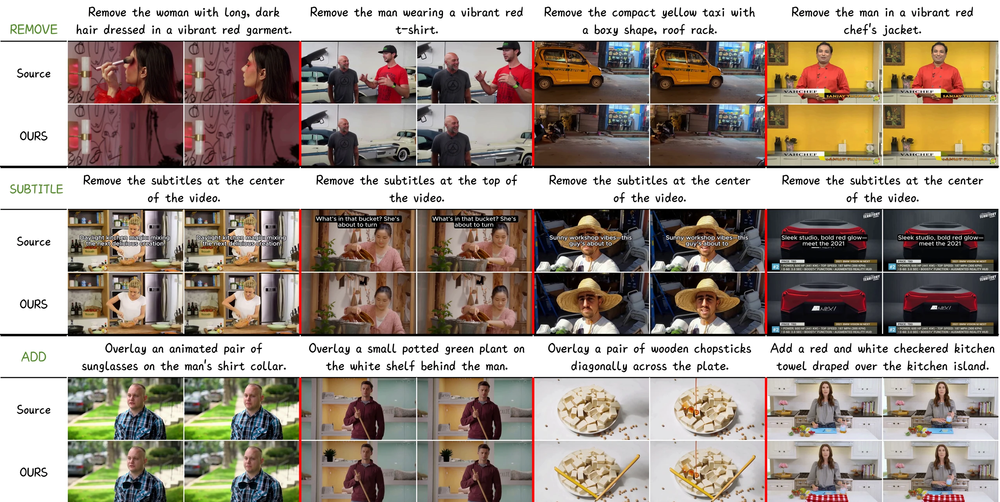
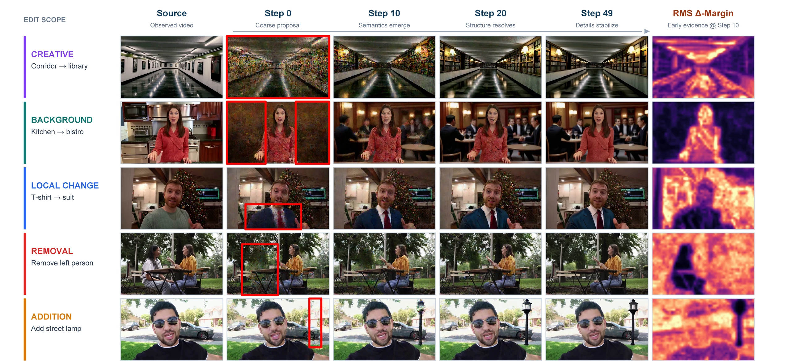

<div align="center">
  <p>
    
    &nbsp;&nbsp;&nbsp;&nbsp;
    
  </p>

  <h1>GRNEdit: Efficient General Video Editing from a New Binary-Evidence Perspective in Generative Refinement Networks</h1>

  <p>
    <a href="https://foxerity.github.io/GRNEdit/"></a>
    <a href="https://arxiv.org/pdf/2608.16328"></a>
    <!--
    <a href="https://huggingface.co/bytedance-research/GRN"></a>
    -->
    <a href="LICENSE"></a>
  </p>

  <p>
    Feng Xie<sup>1,2,*</sup>,
    Jiagao Hu<sup>2</sup>,
    Fuhao Li<sup>2</sup>,
    Zepeng Wang<sup>2</sup>,<br>
    Yuxuan Chen<sup>2</sup>,
    Dahua Gao<sup>1,†</sup>,
    Fei Wang<sup>2</sup>,
    Daiguo Zhou<sup>2</sup>
  </p>

  <p>
    <sup>1</sup>Xidian University
    &nbsp;&nbsp;
    <sup>2</sup>MiLM Plus, Xiaomi Inc.
  </p>

  <p><sup>*</sup>This work was completed during Feng Xie's internship at Xiaomi. We thank Xiaomi for its support.</p>
</div>

<table width="100%">
  <tr>
    <td width="42%" valign="top">
      <h2>Open-source plan</h2>
      <p>
        &#9745;&nbsp; Inference code<br>
        &#9745;&nbsp; Preprint paper<br>
        &#9744;&nbsp; Training code<br>
        &#9744;&nbsp; Model weights
      </p>
    </td>
    <td width="58%" valign="top">
      <h2>Updates &amp; contact</h2>
      <p>We’ll keep sharing updates on GRNEdit. If you find our work interesting, don’t forget to leave us a ⭐.</p>
      <p>📬 Questions about reproduction? Feel free to contact me at <a href="mailto:fengx@stu.xidian.edu.cn">fengx@stu.xidian.edu.cn</a>.</p>
    </td>
  </tr>
</table>

<h2 align="center">Visual results</h2>

<p align="center">
  The examples below cover global appearance, scene background, local removal,<br>
  and compositional editing while preserving source motion and unedited content.<br>
  Click a preview to open the full-resolution comparison video.
</p>

<table align="center">
  <tr>
    <td width="50%" align="center">
      <a href="assets/visualizations/videos/global-style-watercolor.mp4">
        
      </a><br>
      <sub><strong>Global style:</strong> apply a watercolor animation style.</sub>
    </td>
    <td width="50%" align="center">
      <a href="assets/visualizations/videos/background-library-fireplace.mp4">
        
      </a><br>
      <sub><strong>Background:</strong> replace the scene with a classic library and fireplace.</sub>
    </td>
  </tr>
  <tr>
    <td width="50%" align="center">
      <a href="assets/visualizations/videos/remove-person-behind-computer.mp4">
        
      </a><br>
      <sub><strong>Local removal:</strong> remove the person behind the computer.</sub>
    </td>
    <td width="50%" align="center">
      <a href="assets/visualizations/videos/creative-alchemical-symbols.mp4">
        
      </a><br>
      <sub><strong>Creative edit:</strong> remove the flame and add glowing alchemical symbols.</sub>
    </td>
  </tr>
</table>

<h3 align="center">Qualitative results</h3>

<p align="center">
  GRNEdit supports diverse edits ranging from global stylization and background<br>
  replacement to precise local modification, removal, and addition.
</p>

<p align="center">
  
</p>

<p align="center">
  The model also generalizes from object removal to subtitle removal without<br>
  explicit subtitle-removal training examples.
</p>

<p align="center">
  
</p>

<h3 align="center">Progressive editing</h3>

<p align="center">
  Binary evidence identifies the editable scope early; generative refinement then<br>
  progressively resolves target semantics, structure, and fine visual details.
</p>

<p align="center">
  
</p>

## Environment

The reference environment uses Python 3.10, PyTorch 2.5.1, CUDA 12.4, and
FlashAttention-4:

```bash
conda env create -f environment.yml
conda activate grnedit
```

GRNEdit uses the same FA4 CuTeDSL path as the original GRN training and
inference pipeline:

```python
from flash_attn.cute import flash_attn_varlen_func
```

FA4 is optimized for Hopper and Blackwell GPUs. Install it with:

```bash
pip install flash-attn-4
```

For unsupported hardware or a correctness-oriented fallback, pass
`--use_slow_attn 1`. The fallback uses PyTorch scaled-dot-product attention and
is substantially slower.

## Required files

The weight release is a later milestone. Once available, use this layout:

```text
weights/
├── GRN_T2V_2B.pth
├── HBQ_tokenizer_64dim_M4.ckpt
└── umt5-xxl/
    ├── models_t5_umt5-xxl-enc-bf16.pth
    └── umt5-xxl/
        └── ... tokenizer files ...
```

The GRNEdit checkpoint contains its runtime contract. The inference entry point
validates the model family, chunk layout, source-injection mask,
text-conditioning schema, reprompt mode, and available resource fingerprints
before loading weights.

## Metadata

The metadata root may contain JSONL files directly or one directory per
subset. Each row must provide at least:

```json
{
  "source_path": "data/source.mp4",
  "tarsier2_caption": "Replace the car with a green sports car.",
  "reprompt": "A green sports car drives through the original road scene.",
  "begin_frame_id": 0,
  "end_frame_id": 60,
  "fps": 20,
  "width": 1280,
  "height": 720
}
```

`reprompt` is required only when `USE_REPROMPT=1`. The checkpoint records this
choice, and inference rejects a conflicting override.

## GRNEdit inference

```bash
export CHECKPOINT_PATH="checkpoints/stage1/global_step_40000.pth" # GRNEdit checkpoint file
export WEIGHTS_DIR="weights"                                    # GRN, tokenizer, VAE, and T5 weight root
export EDIT_OFFICIAL_META_ROOT="data/metadata"                  # Root containing input JSONL metadata
export EDIT_OFFICIAL_META_SUBDIRS=""                            # Optional comma-separated subset directories
export OUTPUT_DIR="outputs/grnedit"                             # Directory for generated videos and metadata
export NUM_SAMPLES_PER_DATASET=4                                # Maximum samples selected from each subset
export SHUFFLE=1                                                # Shuffle each subset before sample selection
export SAMPLE_SEED=42                                          # Seed used only for metadata sample selection
export SEED=1234                                                # Seed used for video generation
export GPUS=1                                                   # Number of participating GPUs
export WORKERS=2                                                # Inference worker processes launched per GPU
export VIDEO_FPS=20                                             # Output playback frame rate
export VIDEO_FRAMES=61                                          # Number of frames generated per video
export DURATION_RESOLUTION=0.25                                 # Duration bucket resolution in seconds
export TEMPERATURE=1.0                                          # Categorical token sampling temperature
export MAX_INFER_STEPS=50                                       # Maximum generative-refinement iterations
export COMPLEXITY_AWARE_TMIN=10                                 # Lower bound for adaptive refinement iterations
export COMPLEXITY_AWARE_TMAX=0                                  # 0 means use MAX_INFER_STEPS as the upper bound
export SNR_SHIFT=1.0                                            # Signal-to-noise shift used by the sampling schedule
export USE_SLOW_ATTN=0                                          # 0 uses FA4; 1 uses the PyTorch attention fallback
export USE_REPROMPT=0                                           # 1 additionally consumes each row's reprompt field
export T5_MAX_TOKENS=512                                        # Maximum tokens retained from T5 text conditions
export USE_EMA=1                                                # 1 loads EMA weights from the GRNEdit checkpoint
bash scripts/infer_stage1.sh
```

The launcher also forwards arguments appended after the script name. Model
architecture, seven-chunk layout, endpoint source-injection mask, and
`text_pt` residual modulation remain fixed because they form part of the
checkpoint contract.

## Acknowledgements

This work is built upon [GRN: Generative Refinement Networks for Visual
Synthesis](https://arxiv.org/abs/2604.13030) and its
[official codebase](https://github.com/bytedance/GRN). We sincerely thank the
authors for releasing their code and for their exciting work.

## Citation

```bibtex
@article{xie2026grnedit,
  title         = {GRNEdit: Efficient General Video Editing from a New Binary-Evidence Perspective in Generative Refinement Networks},
  author        = {Xie, Feng and Hu, Jiagao and Li, Fuhao and Wang, Zepeng and Chen, Yuxuan and Gao, Dahua and Wang, Fei and Zhou, Daiguo},
  journal       = {arXiv preprint arXiv:2608.16328},
  year          = {2026},
  eprint        = {2608.16328},
  archivePrefix = {arXiv},
  primaryClass  = {cs.CV}
}
```

## License

Code is released under the [MIT License](LICENSE).
