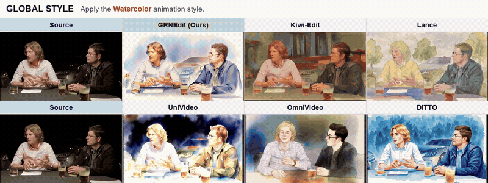
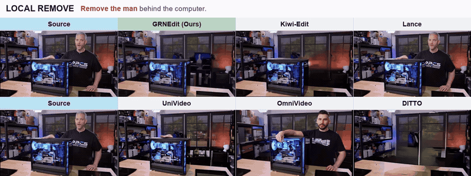
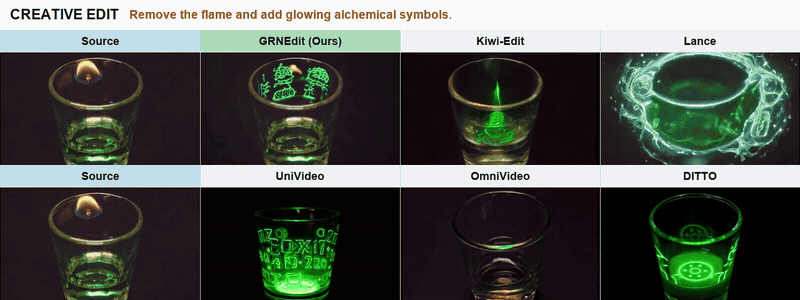
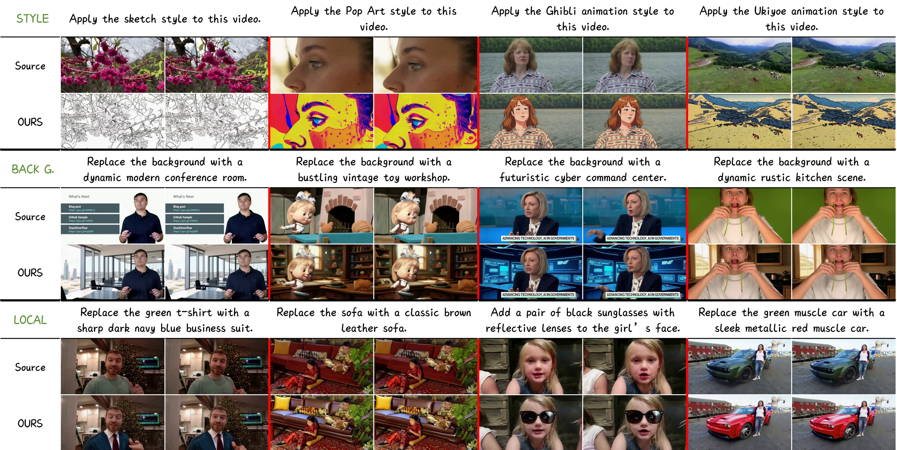
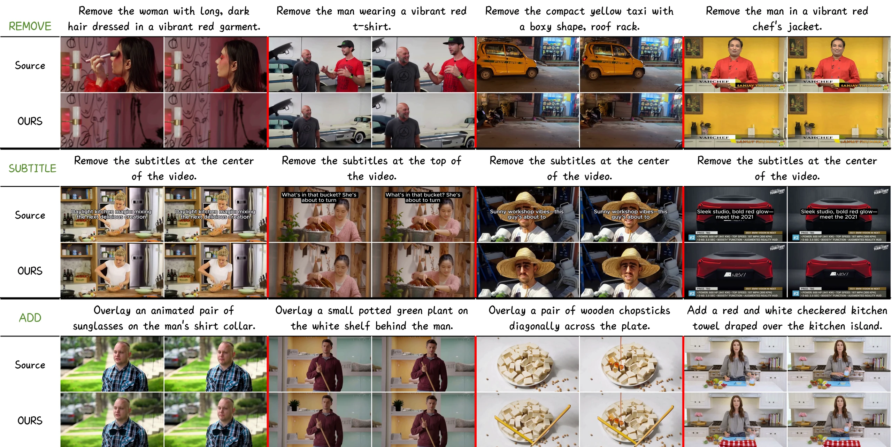
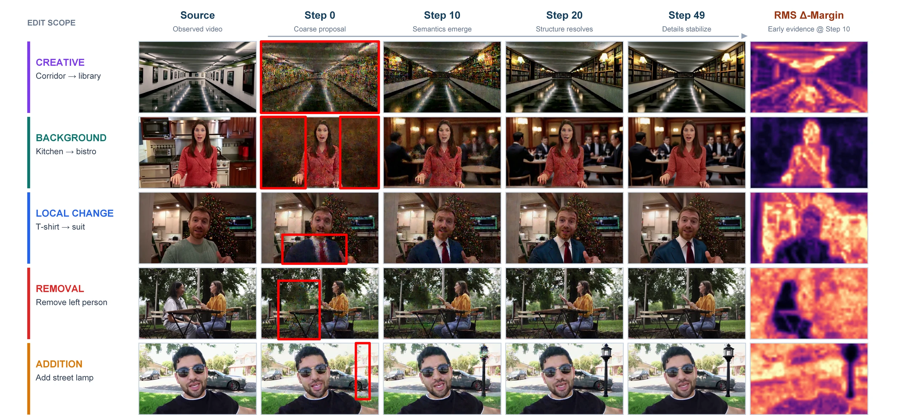

<div align="center">
  <p>
    
    &nbsp;&nbsp;&nbsp;&nbsp;
    
  </p>

  <h1>GRNEdit: Efficient General Video Editing from a New Binary-Evidence Perspective in Generative Refinement Networks</h1>

  <p>
    <a href="https://foxerity.github.io/GRNEdit/"></a>
    <a href="https://arxiv.org/pdf/2608.16328"></a>
    <a href="https://huggingface.co/debugg/GRNEdit"></a>
    <a href="LICENSE"></a>
  </p>

  <p>
    Feng Xie<sup>1,2,*</sup>,
    Jiagao Hu<sup>2</sup>,
    Fuhao Li<sup>2</sup>,
    Zepeng Wang<sup>2</sup>,<br>
    Yuxuan Chen<sup>2</sup>,
    Dahua Gao<sup>1,†</sup>,
    Fei Wang<sup>2</sup>,
    Daiguo Zhou<sup>2</sup>
  </p>

  <p>
    <sup>1</sup>Xidian University
    &nbsp;&nbsp;
    <sup>2</sup>MiLM Plus, Xiaomi Inc.
  </p>

  <p><sup>*</sup>This work was completed during Feng Xie's internship at Xiaomi. We thank Xiaomi for its support.</p>
</div>

<table width="100%">
  <tr>
    <td width="42%" valign="top">
      <h2>Open-source plan</h2>
      <p>
        &#9745;&nbsp; Inference code<br>
        &#9745;&nbsp; Preprint paper<br>
        &#9745;&nbsp; LoRA support<br>
        &#9744;&nbsp; Training code<br>
        &#9744;&nbsp; Model weights
      </p>
    </td>
    <td width="58%" valign="top">
      <h2>Updates &amp; contact</h2>
      <p>We’ll keep sharing updates on GRNEdit. If you find our work interesting, don’t forget to leave us a ⭐.</p>
      <p>📬 Questions about reproduction? Feel free to contact me at <a href="mailto:fengx@stu.xidian.edu.cn">fengx@stu.xidian.edu.cn</a>.</p>
    </td>
  </tr>
</table>

## 🎉 Meet GRNEdit-2B Stage-LoRA!

Better additions, stronger edits! LoRA fine-tuning improves GRNEdit's object
addition quality and lifts its OpenVE-Bench overall score to **4.21**.
With a **2B backbone and only ~1% extra conditioning parameters**, it outperforms
the 14B open-source editors below on overall score.

### OpenVE-Bench results

The paper's main comparison, with our new **GRNEdit-2B Stage-LoRA** result added.
Higher scores are better.

| Method | Backbone | Time | Overall | Global style | Background | Local change | Removal | Addition | Subtitles | Cond. params |
| --- | --- | --- | ---: | ---: | ---: | ---: | ---: | ---: | ---: | --- |
| Runway Aleph | Commercial | — | 4.49 | 4.41 | 4.40 | 4.31 | 4.64 | 4.36 | 4.21 | N/A |
| VACE | 14B | 545s | 3.01 | 3.46 | 2.81 | 2.47 | 3.99 | 1.76 | 4.41 | 3.05B |
| Omni-Video | 11B | 312s | 3.66 | 3.41 | 4.11 | 3.75 | 4.52 | 2.80 | 4.95 | >4.6B |
| InsViE | 2B | 64s | 3.25 | 3.63 | 2.68 | 2.82 | 3.56 | 2.25 | 4.77 | ~59M |
| Lucy-Edit | 5B | 36s | 3.77 | 3.64 | 3.25 | 3.93 | 3.95 | 3.92 | 4.23 | ~0.6M |
| Kiwi-Edit | 8B | 45s | 4.17 | 4.24 | 4.01 | 4.30 | 4.60 | 4.13 | 4.23 | 3B |
| DITTO | 14B | 611s | 3.44 | 4.48 | 3.52 | 2.89 | 3.53 | 2.48 | 3.69 | 3.17B |
| OpenVE-Edit | 5B | 150s | 3.89 | 4.24 | 4.10 | 3.80 | 3.50 | 3.41 | 3.98 | >3B |
| LoomVideo | 5+8B | 166s | 4.09 | 4.44 | 3.91 | 4.02 | 4.22 | 4.21 | 4.66 | 89M |
| UniVideo | 14B | 893s | 4.18 | 4.05 | 3.94 | 4.33 | 4.42 | 4.41 | 4.56 | >7B |
| Lance | 7.1B | 99s | 4.01 | 3.99 | 4.01 | 3.72 | 4.17 | 4.29 | 4.17 | N/A |
| GRNEdit-2B | 2B | 39s | 4.03 | 4.36 | 3.80 | 3.93 | 4.56 | 3.84 | 4.72 | 37M |
| GRNEdit-8B | 8B | 84s | 4.18 | 4.37 | 4.12 | 4.09 | 4.73 | 3.86 | 4.86 | 45M |
| **GRNEdit-2B Stage-LoRA** | **2B** | — | **4.21** | **4.19** | **4.11** | **4.33** | **4.55** | **4.40** | **4.37** | **~1% of backbone** |

Cond. params counts the additional conditioning branches, not all fine-tuned
parameters. Stage-LoRA also scores **3.88** on creative editing and **3.45** on
camera editing, which are not separate columns in the paper's main table.
Its inference time has not yet been reported.

<h2 align="center">Visual results</h2>

<p align="center">
  The examples below cover global appearance, scene background, local removal,<br>
  and compositional editing while preserving source motion and unedited content.<br>
  Click a preview to open the full-resolution comparison video.
</p>

<table align="center">
  <tr>
    <td width="50%" align="center">
      <a href="assets/visualizations/videos/global-style-watercolor.mp4">
        
      </a><br>
      <sub><strong>Global style:</strong> apply a watercolor animation style.</sub>
    </td>
    <td width="50%" align="center">
      <a href="assets/visualizations/videos/background-library-fireplace.mp4">
        
      </a><br>
      <sub><strong>Background:</strong> replace the scene with a classic library and fireplace.</sub>
    </td>
  </tr>
  <tr>
    <td width="50%" align="center">
      <a href="assets/visualizations/videos/remove-person-behind-computer.mp4">
        
      </a><br>
      <sub><strong>Local removal:</strong> remove the person behind the computer.</sub>
    </td>
    <td width="50%" align="center">
      <a href="assets/visualizations/videos/creative-alchemical-symbols.mp4">
        
      </a><br>
      <sub><strong>Creative edit:</strong> remove the flame and add glowing alchemical symbols.</sub>
    </td>
  </tr>
</table>

<h3 align="center">Qualitative results</h3>

<p align="center">
  GRNEdit supports diverse edits ranging from global stylization and background<br>
  replacement to precise local modification, removal, and addition.
</p>

<p align="center">
  
</p>

<p align="center">
  The model also generalizes from object removal to subtitle removal without<br>
  explicit subtitle-removal training examples.
</p>

<p align="center">
  
</p>

<h3 align="center">Progressive editing</h3>

<p align="center">
  Binary evidence identifies the editable scope early; generative refinement then<br>
  progressively resolves target semantics, structure, and fine visual details.
</p>

<p align="center">
  
</p>

## Environment

The reference environment uses Python 3.10, PyTorch 2.5.1, CUDA 12.4, and
FlashAttention-4:

```bash
conda env create -f environment.yml
conda activate grnedit
```

GRNEdit uses the same FA4 CuTeDSL path as the original GRN training and
inference pipeline:

```python
from flash_attn.cute import flash_attn_varlen_func
```

FA4 is optimized for Hopper and Blackwell GPUs. Install it with:

```bash
pip install flash-attn-4
```

For unsupported hardware or a correctness-oriented fallback, pass
`--use_slow_attn 1`. The fallback uses PyTorch scaled-dot-product attention and
is substantially slower.

## Model zoo

Weights are hosted in [debugg/GRNEdit](https://huggingface.co/debugg/GRNEdit/tree/main).
The repository is currently private; these links will become publicly accessible
when the weight release opens.

| Model | Weights | Format | Public inference code |
| --- | --- | --- | --- |
| GRNEdit-2B | [Download](https://huggingface.co/debugg/GRNEdit/resolve/main/GRNEdit-2B.pth) | Full checkpoint, including EMA | `scripts/infer_stage1.sh` |
| GRNEdit-2B Stage-LoRA | [Download](https://huggingface.co/debugg/GRNEdit/resolve/main/GRNEdit-2B-Stage-LoRA.pth) | Full backbone + LoRA + source branches | `scripts/infer_stage_lora.sh` |
| GRNEdit-8B | [Weight parts](https://huggingface.co/debugg/GRNEdit/tree/main/GRNEdit-8B) | Split full checkpoint | Not released yet |

The public inference release supports **2B only**. The full Stage-LoRA checkpoint
does not need a separate base GRN checkpoint; both variants still need their
matching VAE and UMT5 resources. Original training checkpoints must retain the
runtime metadata required by the loader; uploading weights alone does not supply
missing configuration.

## Required files

The weight release is a later milestone. Once available, use this layout:

```text
weights/
├── GRN_T2V_2B.pth
├── HBQ_tokenizer_64dim_M4.ckpt
└── umt5-xxl/
    ├── models_t5_umt5-xxl-enc-bf16.pth
    └── umt5-xxl/
        └── ... tokenizer files ...
```

The GRNEdit checkpoint contains its runtime contract. The inference entry point
validates the model family, chunk layout, source-injection mask,
text-conditioning schema, reprompt mode, and available resource fingerprints
before loading weights.

## Metadata

The metadata root may contain JSONL files directly or one directory per
subset. Each row must provide at least:

```json
{
  "source_path": "data/source.mp4",
  "tarsier2_caption": "Replace the car with a green sports car.",
  "reprompt": "A green sports car drives through the original road scene.",
  "begin_frame_id": 0,
  "end_frame_id": 60,
  "fps": 20,
  "width": 1280,
  "height": 720
}
```

`reprompt` is required only when `USE_REPROMPT=1`. The checkpoint records this
choice, and inference rejects a conflicting override.

## GRNEdit inference

```bash
export CHECKPOINT_PATH="checkpoints/GRNEdit-2B.pth"               # Full checkpoint or split-checkpoint directory
export WEIGHTS_DIR="weights"                                    # GRN, tokenizer, VAE, and T5 weight root
export EDIT_OFFICIAL_META_ROOT="data/metadata"                  # Root containing input JSONL metadata
export EDIT_OFFICIAL_META_SUBDIRS=""                            # Optional comma-separated subset directories
export OUTPUT_DIR="outputs/grnedit"                             # Directory for generated videos and metadata
export NUM_SAMPLES_PER_DATASET=4                                # Maximum samples selected from each subset
export SHUFFLE=1                                                # Shuffle each subset before sample selection
export SAMPLE_SEED=42                                          # Seed used only for metadata sample selection
export SEED=1234                                                # Seed used for video generation
export GPUS=1                                                   # Number of participating GPUs
export WORKERS=2                                                # Inference worker processes launched per GPU
export VIDEO_FPS=20                                             # Output playback frame rate
export VIDEO_FRAMES=61                                          # Number of frames generated per video
export DURATION_RESOLUTION=0.25                                 # Duration bucket resolution in seconds
export TEMPERATURE=1.0                                          # Categorical token sampling temperature
export MAX_INFER_STEPS=50                                       # Maximum generative-refinement iterations
export COMPLEXITY_AWARE_TMIN=10                                 # Lower bound for adaptive refinement iterations
export COMPLEXITY_AWARE_TMAX=0                                  # 0 means use MAX_INFER_STEPS as the upper bound
export SNR_SHIFT=1.0                                            # Signal-to-noise shift used by the sampling schedule
export USE_SLOW_ATTN=0                                          # 0 uses FA4; 1 uses the PyTorch attention fallback
export USE_REPROMPT=0                                           # 1 additionally consumes each row's reprompt field
export T5_MAX_TOKENS=512                                        # Maximum tokens retained from T5 text conditions
export USE_EMA=1                                                # 1 loads EMA weights from the GRNEdit checkpoint
bash scripts/infer_stage1.sh
```

The launcher also forwards arguments appended after the script name. Model
architecture, seven-chunk layout, endpoint source-injection mask, and
`text_pt` residual modulation remain fixed because they form part of the
checkpoint contract.

### Stage-LoRA inference (2B)

Install the additional LoRA dependencies in the same environment:

```bash
pip install -r requirements-stage-lora.txt
```

```bash
export CHECKPOINT_PATH="checkpoints/GRNEdit-2B-Stage-LoRA.pth" # Full Stage-LoRA checkpoint or split directory
export WEIGHTS_DIR="weights"                                # VAE and UMT5 resource root
export VAE_PATH="weights/HBQ_image_video_tokenizer_64dim_M4_20260626.ckpt" # Matching Stage-LoRA tokenizer
export T5_PATH="weights/umt5-xxl"                            # UMT5 encoder and tokenizer root
export EDIT_OFFICIAL_META_ROOT="data/metadata"               # Source-video JSONL metadata
export EDIT_OFFICIAL_META_SUBDIRS=""                         # Optional comma-separated subsets
export OUTPUT_DIR="outputs/stage_lora"                       # Generated videos and per-rank result JSONL
export GPUS=1                                              # Independent inference processes, one per GPU
export NUM_SAMPLES_PER_DATASET=4                            # 0 processes every metadata row
export SHUFFLE=1                                           # Shuffle before selecting samples
export SAMPLE_SEED=42                                      # Metadata selection seed
export SEED=1234                                           # Video generation seed
export GUIDANCE_MODE=none                                  # Conditional-only inference; no CFG branch
export MAX_INFER_STEPS=50                                  # Refinement iterations
export TEMPERATURE=1.0                                     # Token sampling temperature
export SNR_SHIFT=1.0                                       # Refinement signal-to-noise shift
export USE_SLOW_ATTN=0                                     # 0: FA4; 1: explicit, slower SDPA fallback
export SKIP_EXISTING=1                                     # Skip videos already generated in OUTPUT_DIR
bash scripts/infer_stage_lora.sh
```

Branch positions/count, LoRA rank, alpha, and text-conditioning settings are
restored from the checkpoint; there is no need to enter them manually. The
source video, instruction, frame interval, and FPS are sufficient for inference;
target videos are not needed. The instruction field and optional `reprompt`
must match the checkpoint's text settings.

For a compact adapter export, set `CHECKPOINT_PATH` to the adapter directory
and `BASE_CHECKPOINT` to its matching GRN base weights. The directory must include
`adapter_model.safetensors`, `source_branch.safetensors`,
`stage_lora_config.json`, and `runtime.json`.

### Split checkpoints: no manual merge needed

Both 2B inference launchers accept a directory containing numbered byte parts
(`NAME.pth.000.part`, `NAME.pth.001.part`, …) and `SHA256SUMS`, whose entry is
the SHA-256 of the complete `NAME.pth` file. Download **all** parts and the checksum
file, then point `CHECKPOINT_PATH` at that directory.

The first run streams the parts into a verified full checkpoint under
`~/.cache/grnedit/checkpoints`; later runs reuse it. Set
`GRNEDIT_CHECKPOINT_CACHE` to choose another cache disk. Assembly requires extra
free space equal to the complete checkpoint size, but does not load the whole
file into RAM. Concurrent workers share a merge lock. Source files are unchanged.
This packaging support does **not** enable 8B inference.

## Acknowledgements

This work is built upon [GRN: Generative Refinement Networks for Visual
Synthesis](https://arxiv.org/abs/2604.13030) and its
[official codebase](https://github.com/bytedance/GRN). We sincerely thank the
authors for releasing their code and for their exciting work.

## Citation

```bibtex
@article{xie2026grnedit,
  title         = {GRNEdit: Efficient General Video Editing from a New Binary-Evidence Perspective in Generative Refinement Networks},
  author        = {Xie, Feng and Hu, Jiagao and Li, Fuhao and Wang, Zepeng and Chen, Yuxuan and Gao, Dahua and Wang, Fei and Zhou, Daiguo},
  journal       = {arXiv preprint arXiv:2608.16328},
  year          = {2026},
  eprint        = {2608.16328},
  archivePrefix = {arXiv},
  primaryClass  = {cs.CV}
}
```

## License

Code is released under the [MIT License](LICENSE).
